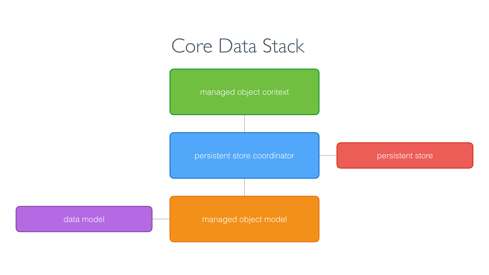

# Swift Basics Note

## Variables & Functions

### Variables

Variables are used to temporarily store data in the memory in programming. In Swift, variables are declared with the `var` keyword.

```
var lastNaem: String = "Tokuda" // String
var rollNo: Int = 101 // Int
var num: Float = 11.2 // Float
var number: Double = 12345.11 // Double
var isCorrect: Bool = false // Boolean
```

### Constants

Constants are similar to variables, however, data stored as a constant cannot be modified after the initialization. Constants are defined with `let` keyword in Swift.

```
let fullName = "Suguru Tokuda"
fullName = "Tokuda, Suguru" // Not allowed
```

### Data Types

Swift supports various data types. Examples of data types are:

- `String`
- `Character`
- `Int`
- `Float`
- `Double`

### Type inferencing

When declaring variables, Swift can automatically detect the type if `=` is used to assign initial value.

```
// These two lines are equivalent.
var name = "Suguru"
var name: String = "Suguru"
```

When it comes to numbers, Swift automatically picks a lower data type to save memory usage.

```
var num = 1 // considered as Int instead of Double.
```

### Type Safety

Swift has Type Safety mechanism which prevents a variable from having other data type values.

```
// The following code throws a compilation error.
var name = "Suguru" // String
name = 1234 // assining Int value into a String variable is not allowed.
```

### ARC - Automatic Reference Counting (Memory Management)

Swift counts active memory reference and remove unused reference from memory just like other languages such as Java and C#.

### Functions

Functions/Methods are considered as behaviors and actions in programming.

1. Simple function without any arguments or return type. You can append `-> Void` at the end of function definition as a return type but this is not necessary.

```
func doAction() {
    print("doing maths")
}

func doStuff() -> Void {
    print("doing stuff")
}
```

2. Functions with parameters

```
func doSum(num1: Int, num2: Int) {
    let result = num1 + num2
    print(result)
}

doSum(num1: 2, num2: 2) // 4 is printed
```

3. Functions with return values

```
func doSutraction(n1: Int, n2: Int) -> Int {
    return n1 - n2
}

print(String(doSubtraction(n1: 1, n2: 1))) // prints 0

// The following function definition can omit paramter names when calling it by using `_`.
func addNumbers(_ n1: Int, _ n2: Int) -> Int {
    return n1 + n2
}

print(String(addNumbers(1, 1,))) // prints 2

// You can also give external parameter names
func divideNumbers(numerator n: Int, denominator d: Int) -> Float {
    return Float(n) / Float(d)
}

print(String(divideNumbers(numerator: 1, denominator: 2))) // prints 0.5

```

### String Formatting

When printing or formatting a String with variables (that are not string types), `\()` is used to concatenate.

```
var sal = 100

print("My salary is $\(100)k") // prints My salary is $100k"
```

### Tuple

Tuples are a group of data. This enables a function to return more than one values. Tuples are created by using `()`

```
var tuple = (1, "A", true)
var tuple2: (Int, String, Bool) = (2, "B", false)

func getTuple() -> (String, Bool) {
    return ("This is true", true)
}
```

---

## Collections

### Array

Array is a sequence of values as a group. Array can contain the same data type or any data type (`Any`).

```
var numbers: [Int] = [1, 2, 3] // With data type definied and initial values are given.
var numbers2 = [1, 2, 3] // Uisng type inference
var numbers3 = [Int]() // Empty array
```

Accessing data from the array can be done by using a property or `[]`.

```
numbers[0] // get 1
numbers.first // Optional(1)
```

Adding data into an array can be done append (O(1)) insert(O(n))

```
numbers.append(5) // append at the end of array
numbers2.insert(1, at: 0) // prepends
```

Removing an element from the array can be achieved by `remove(at: Int)`

```
numbers.remove(at: 0) // removing 1 from the array
```

### Set

Set is another data structure in Swift which can contain only unique elements. Data in a set cannot be sorted. Set uses hash algorithm, therefore, inserting and deleting have O(1) time complexity.

```
var programmingLanguages: Set<String> = []

// Insert
programmingLanguages.insert("Swift")
programmingLanguages.insert("Objective-C")
programmingLanguages.insert("Java")
programmingLanguages.insert("C#")
programmingLanguages.insert("TypeScript")

// accessing data from a set
// 1. use a built in function
if let swift = programmingLanguages.first(where: { $0 == "Swift" }) {
    print(swift)
}

// 2. Find an index
if let swiftIndex = programmingLanguages.firstIndex(where: { $0 == "Swift" }) {
    print(programmingLanguages[swiftIndex])
}

// 3. Iterate a set
programmingLanguages.forEach { el in
    print(el)
}

// Remove from sets
programmingLanguages.remove("Swift")

print(programmingLanguages)
```

### Dictionary

Dictionary is a data structure for key value pairs. You can set any data type as key and value.

```
// Key: employee's first name. value: id
var employees: [String : Int] = [:]

// insert into a dictionary
employees["Mike"] = 1
employees["Sarah"] = 2
employees["Ken"] = 3
employees["Guile"] = 4

// accessing the data by key
if let sarahId = employees["Sarah"] {
    print(sarahId)
}

// remove from a dictionary
employees["Sarah"] = nil
// Sarah is removed
print(employees)
```

## Optional

Optional type is defined by appending `?` after the data type or assining an optional value from the return type in function. The default value for optional types are `nil`. This is useful when a property does not need to have any value in the application. Under the hood, enum is an enum with .Some(Wrapped) and .None cases.

```
// Assign a value after declaration
var phoneNumber: String?
phoneNumber = "123-456-7890"

// Assignng a value on declaration
var isStudent: Bool? = false

// A function with an optionak type
function getNumber(isCorrect: Bool) -> Int? {
    if isCorrect {
        return 1
    } else {
        return nil
    }
}

var num = getNumber(isCorrect: false)
print(num) // prints nil
```

### Optional Binding

Optional binding is the way unwrap a value from an optional type. If there is a value in it and attempting accessing a value without unwrapping always return "Optional(value)"

1. `if let`
   <br>
   `if let` creates a temp variable and the wrapped value is available inside the block if there is a value (not nil).

```
var num: Int? = 0
if let number = num {
    print(number) // prints 0
}

// shorthand if let
if let num {
    print(num) // prints 0
}
```

2. `guard let`
   <br>
   `guard let` is similar to `if let`, however, `guard let` prevents the program to go any further if the value is nil. `guard let` should be used for edge cases.

```
var num: Int?

func performGuardLet() {
    guard let num else { return }
    print(num) // this line will not be executed.
}
```

3. `Coalescing (??)`
   <br>
   By using `??` after the variable, it can specify the default value if the optional variable is nil. It is useful to avoid using multiple if let and guard let; promotes code readability.

```
var num: Int?
var newNum: Int = num ?? 0

print(newNum) // prints 0
```

4. `Force unwrap (!)`
   <br>
   With `Force unwrap (!)`, the value is unwrapped forcefully; even if there is not value in it. `!` should be used when the chance of getting the value is 100%, because the program will through an error if `nil` is unwrapped.

## Class & Struct

### Class

Classes allows to create a block of code which can contain variables, constants, and functions. Class allows Object Oriented Programming (1. Abstraction, 2. Polyphormism, 3. Inheritance, 4. Encapsulation).

Classes are reference type in Swift and the objects initialized by classes are stored in the heap memory.

```
class Person {
    var firstName: String = ""
    var lastName: String = ""

    // initializer with no arguments.
    init() {}

    // parent class initializer
    init(firstName: String, lastName: String) {
        self.firstName = firstName
        self.lastName = lastName
    }

    func jump() {
        print("\(firstName) \(lastName) is jumping.")
    }
}

let person = Person(firstName: "Suguru", lastName: "Tokuda")
let person2 = Person()
person2.firstName = "Kit"
person2.lastName = "Kat"
person2.jump()

// child class that inherits Person class
class Employee: Person {
    var id: Int

    // child class initializer
    init(firstName: String, lastName: String, id: Int) {
        self.id = id
        super.init(firstName: firstName, lastName: lastName)
    }

    func work() {
        print("\(firstName) \(lastName) (Id: \(id)) is working.")
    }
}

let employee = Employee(firstName: "Tom", lastName: "Hardy", id: 1)
employee.jump()
employee.work()

// creates a reference copy
let employee2 = employee
employee2.firstName = "Henry"

// both employee and employee2 has Henry for their firstName
print(employee.firstName)
print(employee2.firstName)
```

### Struct

Struct is similar to class, however, Struct is value type and the objects initialized by structs are stored in the stack memory. Structs are light weight and preferred in the Swift programming. Structs do not support inheritance but it supports protocols.

Unlike class, Structs are immutable by default. Modifying properties are possible by creating `mutating func`. Under the hood, Swift creates a brand new data based on the new value and pops the old data from the stack memory.

```
struct Fighter {
    var name: String
    var healthPoint: Int
    var attackPoint: Int

    func attack() {
        print("\(name) attacked (attack point: \(attackPoint)).")
    }

    // when mutating func is called
    // the data is popped from the stack memory
    // and the copy of the data gets inserted into
    // the stack memory
    mutating func changeName(newName: String) {
        self.name = newName
    }
}

let fighterA = Fighter(name: "Cloud", healthPoint: 100, attackPoint: 20)
// since all properties are not optional, the following code throws a compliation error
// let fighterB = Fighter()
// creates a deep copy
var fighterB = fighterA

fighterB.name = "Tifa"

print(fighterA.name)
print(fighterB.name)
```

## Control Statements

1. `if`

```
var number = 5

if number == 5 {
    print("correct number")
}
```

2. `if {} else if {}`

```
if number < 5 {
    print("number is smaller than 5")
} else if number > 5{
    print("number is greater than 5")
}
```

3. `if {} else if {} else`

```
if number < 5 {
    print("number is smaller than 5")
} else if number > 5 {
    print("number is greater than 5")
} else {
    print("other case")
}
```

4. Switch Statement

```
var char: Character = "a"

switch char {
case "a":
    print("printing 'a'")
case "b":
    print("printing 'b'")
case "c":
    print("printing 'c'")
default:
    print("default")
}
```

## Loops

1. `for loop`
   <br>
   for loops iterate through range, arrays, sets, and dictionary.

```
// print 0 to 4
for i in 0..<5 {
    print(i)
}

// print 0 to 20 (includes 20) and skip by 2
for i in stride(from: 0, through: 20, by: 2) {
    print(i)
}

// print 0 to 20 (exluddes 20) and skip by 2
for i in stride(from: 0, to: 20, by: 2) {
    print(i)
}

// iterate an array
let nums: [Int] = [1, 2, 3, 4, 5]
for num in nums {
    print(num)
}

// iterate a set
let animals: Set<String> = ["Dog", "Cat", "Bird"]

for animal in animals {
    print(animal)
}

// iterate a dictionary
let employees: [Int : String] = [1: "Emp1", 2: "Emp2", 3: "Emp3"]

for (key, val) in employees {
    print("key: \(key), val: \(val)")
}
```

2. `while loop`
   <br>
   `while loop` iterates until the condition is satisfied.

```
var whileNum = 0

while whileNum < 20 {
    print(whileNum)
    whileNum += 1
}
```

3. `repeat {} while condition`
   <br>
   Similar to while loop, but the while block runs at least once.

```
repeat {
    print(whileNum)
    whileNum += 1
} while whileNum == 20
```

## Initializers

1. Default initializer
   <br>Values are initialized when class properties are declared

```
class PersonForAssign3 {
    var firstName: String = "Suguru"
    var lastName: String = "Tokuda"
}

let per1 = PersonForAssign3()
```

2. Membership initializer
   <br>
   Applies only for structs. The initializer is generated automatically by Swift without specifying default values for non-optional values.

```
struct PersonStructForAssign3 {
    var firstName: String
    var lastName: String
}

let per2 = PersonStructForAssign3(firstName: "Suguru", lastName: "Tokuda")
```

3. Custom Initializer
   <br>
   Your own initializer for either class or struct.

```
class PersonClassWithCustomInit {
    var firstName: String
    var lastName: String
    var email: String

    init(firstName: String, lastName: String, email: String) {
        self.firstName = firstName
        self.lastName = lastName
        self.email = email
    }
}

struct PersonStructWithCustomInit {
    var firstName: String
    var lastName: String
    var email: String

    init(firstName: String, lastName: String, email: String) {
        self.firstName = firstName
        self.lastName = lastName
        self.email = email
    }
}

var personClassWithCustomInit = PersonClassWithCustomInit(firstName: "Suguru", lastName: "Tokuda", email: "stokuda@email.com")

var personStructWithCustomInit = PersonStructWithCustomInit(firstName: "Suguru", lastName: "Tokuda", email: "stokuda@email.com")
```

4. Failable initializer
   <br>
   An initilizer which can result in nil (Optinal).

```
struct Pet {
    var name: String
    var type: String
    var dateOfBirth: Date

    init?(name: String, type: String, dateOfBirth: Date?) {
        guard let dob = dateOfBirth else { return nil }
        // check if dateOfBirth is not future
        if dob > Date() {
            return nil
        }

        self.name = name
        self.type = type
        self.dateOfBirth = dob
    }
}

let pet1: Pet? = Pet(name: "MyPet", type: "Dog", dateOfBirth: DateFormatter().date(from: "01/01/2100"))

// nil is printed becauase dateOfBirth needs to be in the past than the current date.
print(pet1)
```

5. Required initializer
   <br>
   The child classes which inherits a parent class which have required initializer needs to contain the same initializer.

```
class CheckboxItem {
    var isSelected: Bool?

    required init(isSelected: Bool) {
        self.isSelected = isSelected
    }
}

class ChildCheckboxItem: CheckboxItem {
    var title: String

    init(isSelected: Bool, title: String) {
        self.title = title
        super.init(isSelected: isSelected)
    }

    required init(isSelected: Bool) {
        self.title = ""
        super.init(isSelected: isSelected)
    }
}

var checkboxItem = ChildCheckboxItem(isSelected: false, title: "Checkbox")
```

## Enums

`Enums` are value type and are widely used in Swift programming. It allows developers organize the code by having multiple switch statements for each case.

### Raw value enum

<br>
Raw value enums contain simple data type such as String and Int. For String type, if no specific value is specified it the string characters used as case is used.

```
enum Animals: String {
case dog = "Dog",
cat = "Cat",
horse
}

print(Animals.dog.rawValue) // "Dog
print(Animals.cat.rawValue) // "Cat"
print(Animals.horse.rawValue) // "hourse" because no specific value is assigned.

// The first value for Int is 0 if no value is specified.
enum Languages: Int {
case English,
Spanish = 5,
French
}

print(Languages.English.rawValue) // 0
print(Languages.Spanish.rawValue) // 5
print(Languages.French.rawValue) // 6 because 5 is assigned to Spanish. French is next and 6 is automatically assigned to it.

```

### Associated Type Enum

<br>
Associated Type Enum can pass value for each case. Enum can also contain variables and functions.

```
enum iPhones {
case iPhone15(price: Int)
case iPhone14(price: Int)
case otherPhone(price: Int)
case unclassified

    // variable inside enum
    var defaultPrice: Int { return 200 }

    // function inside enum
    func getPrice() -> Int {
        switch self {
        case .iPhone15(price: let price):
            return price
        case .iPhone14(price: let price):
            return price
        case .otherPhone(price: let price):
            return price
        default:
            return defaultPrice
        }
    }

}

var iPhone15 = iPhones.iPhone15(price: 1500)
var iPhone14 = iPhones.iPhone14(price: 1000)
var iPhoneSE = iPhones.otherPhone(price: 500)
var oldIPhone = iPhones.unclassified

print(String(iPhone15.getPrice()))
print(String(iPhone14.getPrice()))
print(String(iPhoneSE.getPrice()))
print(String(oldIPhone.getPrice()))
```

## Protocols

Defines the list of rules or blueprints which class, struct or enum need to adopt/confirm to it. Types that confirm to protocols nee to give implementation for function/variables. Protocols make it possible to have polyphormis and abstraction.

```
protocol Driveable {
    // You cannot assign initial value to a variable.
    // Needs at least get. set is not reuiqred.
    var numberOfGears: Int { get set }

    func accelerate(speed: Int)
    func applyBreaks()

    // Optional function
    func stearing(direction: String)
}

extension Driveable {
    // defualt implementation
    func stearing(direction: String) {
        print("Stearing in Driveable protocol in \(direction)")
    }

    var numberOfGears: Int {
        return 1
    }
}

struct Car : Driveable {
    var numberOfGears: Int

    func accelerate(speed: Int) {
        print("Accelerating by \(speed)")
    }

    func applyBreaks() {
        print("Applying breaks")
    }

// no need to implement because default implementation is created.
//    func stearing(direction: String) {
//        print("stearing the Car in \(direction)")
//    }
}

let c1 = Car(numberOfGears: 5)
c1.accelerate(speed: 10)
c1.stearing(direction: "Left")
c1.applyBreaks()
print("")

struct Truck : Driveable {
    var numberOfGears: Int

    func accelerate(speed: Int) {
        print("Accelerating Truck by \(speed)")
    }

    func applyBreaks() {
        print("Applying breaks for Truck")
    }

    func stearing(direction: String) {
        print("Stearing the Truck in \(direction)")
    }

    // good practice.
    // make variables private
    mutating func setNumberOfGears(gears: Int) {
        self.numberOfGears = gears
    }
}

var t1 = Truck(numberOfGears: 6)
t1.accelerate(speed: 100)
t1.stearing(direction: "Right")
t1.applyBreaks()
t1.setNumberOfGears(gears: 7)
print("")

class ElectricCar : Driveable {
    var numberOfGears: Int = 10

    func accelerate(speed: Int) {
        print("Accelerating Electric car by \(speed)")
    }

    func applyBreaks() {
        print("Applying breaks for Electric car")
    }
}

let electricCar = ElectricCar()
electricCar.stearing(direction: "Left")
```

## Extensions

Extensions allow us to add more meaning/functionality to the existing types or we can use them for protocol confirmance.

```
extension Int {
    func square() -> Int {
        return self * self
    }

    // varialbes need to be a Computed Varialbe
    var isNumberEven: Bool {
        return self % 2 == 0
    }
}

let i1: Int = 5
let result = i1.square()
print("Square - \(i1) is \(result)")
```

## Properties and Different Types and Uses

### Stored Properties

<br>
Stored propeties are stored in the memory for class, struct, and enum.

```
protocol WildAnimal {
    var runningSpeedInMiles: Int { get set }
}
```

### Computed Properties

<br>
Computed properties are similar to functions. The code inside the block gets executed everytime the proerty gets accessed.

```
extension WildAnimal {
    // Computed property: gets executed every time it gets called
    var walkingSpeedInMiles: Int {
        print("Computed property")
        return runningSpeedInMiles / 2
    }
}
```

## Generics

Generics enables to write flexible and reusable code and avoid duplication of code. Since Swift does not support function overloading, using Generics is a good solution to write DRY code.

```
func multiplyNumbers<T: Numeric>(num1 : T, num2: T) -> T {
    let res = num1 * num2
    print("Generics res = \(res)")
    return res
}

multiplyNumbers(num1: 2, num2: 3)
multiplyNumbers(num1: 2.5, num2: 2)
```

Generic can also be used for classes, structs, and enums. The advantage of Generics in any data types is to make the code reusable.

### Generic with Class

```
class Housing {
    var numberOfBedrooms: Int

    init(numberOfBedrooms: Int) {
        self.numberOfBedrooms = numberOfBedrooms
    }
}

class House : Housing {
    var houseName: String

    init(houseName: String, numberOfBedRooms: Int) {
        self.houseName = houseName
        super.init(numberOfBedrooms: numberOfBedRooms)
    }
}

class Apartment : Housing {
    var apartmentName: String

    init(apartmentName: String, numberOfBedrooms: Int) {
        self.apartmentName = apartmentName
        super.init(numberOfBedrooms: numberOfBedrooms)
    }
}

class PersonClassForAss5<T> {
    var firstName: String
    var lastName: String
    var property: T

    init(firstName: String, lastName: String, property: T) {
        self.firstName = firstName
        self.lastName = lastName
        self.property = property
    }
}

let personWithHouse = PersonClassForAss5(firstName: "Suguru", lastName: "Tokuda", property: House(houseName: "House", numberOfBedRooms: 5))
let personWithApartment = PersonClassForAss5(firstName: "Suguru 2", lastName: "Tokuda 2", property: Apartment(apartmentName: "Apartment", numberOfBedrooms: 2))
```

### Generic with Stack

```
struct Stack<T> {
    var stack: [T] = []
    var count: Int = 0 // used to track the length of the stack

    // add a new element to the stack at the end of the array
    // then increment the count by 1
    mutating func add(_ element: T) {
        stack.append(element) // add to the array
        count += 1
    }

    // Removes the last element and return it if exists.
    // If doesn't exist then it returns nil.
    mutating func pop() -> T? {
        if let retVal = stack.last {
            count -= 1
            return retVal
        } else {
            return nil
        }
    }
}

var stack = Stack<Int>()

stack.add(1)
stack.add(2)
stack.add(3)

print("After adding elements in the stack: \(stack.stack)")

if let removed = stack.pop() {
    print("\(removed) was removed")
}

print("After removal: \(stack.stack)")
```

### Generic with enum

```
enum GenericEnum<T> {
    case one(val: T),
         two(val: T),
         three(val: T)

    func getValue() -> T {
        switch self {
        case .one(val: let val):
            return val
        case .two(val: let val):
            return val
        case .three(val: let val):
            return val
        }
    }
}

var one = GenericEnum<String>.one(val: "one")
print(one.getValue())
```

## Closures (Reference Type)

Closures are unnamed/anonymous functions. Those functions can be passed as a function argument or assign it to variables. Closures are flexible and poweful functions which enable flexible operations in swift code. It is commonly used when synchronous operations are done in Swift for multi-threading and api calls. It is used as a call back function.

There are 4 types of closures in Swift:

1. Non escaping closures
2. Escaping closures
3. Trailing closures
4. Auto closures

`Non Escaping Closue`: simply assining a block (anonymous function) to a variable.

```
let nonEscapingClosure = {
    print("I'm not escaping...")
}
```

Print "I'm not escaping..."

```
nonEscapingClosure()
```

`Escaping closure`: escaping closure takes an argument. The calling function can contain any logic with the return value.

```
func escapingClosure(val: Int, complesion: (Int) -> (), isEscaping: Bool) {
    if isEscaping && val > 5 {
        complesion(val)
    }
}
```

The closure gets called because isEscaping is true

```
escapingClosure(val: 6, complesion: { val in
    print(val)
}, isEscaping: true)
```

The closure never gets called

```
escapingClosure(val: 4, complesion: { val in
    print(val) // never gets executed
}, isEscaping: false)
```

`Trailig closure`: the closure that is at the end of the function parameter

```
func trailingClosure(val: String, _ completion: (String) -> Void) {
    print(val)
}
```

Calling a closure func with short hand.

```
trailingClosure(val: "This is an example of a trailing closure") { print($0) }
```

`Auto Closure`: a type of closure without any paramter. Used as a call back.

```
func onBtnClick(action: () -> ()) {
action()
}

onBtnClick {
print("Btn clicked!")
}
```

@escaping
@escaping needs to be added before the closure if the function contains synchronous code.

```
func timer(completion: @escaping () -> ()) {
print("Got into the sleep func")

    DispatchQueue.global(qos: .background).async {
        print("Background thread!")

        DispatchQueue.main.asyncAfter(deadline: .now() + 5) {
            print("Back to main after 5 seconds!")
            completion()
        }
    }
}

timer {
    print("timer called after completion")
}
```

## Higher Order Functions

Higher order functions take a collection. The caller can use a custom function (closure) to various operations such as:

1. `map`: takes a collection and return a collection

```
var randomNums: [Int] = []
for i in 0..<100 {
    // add random num
    randomNums.append(Int.random(in: 1..<100))
}

let randomNumsPlusOne = randomNums.map { $0 + 1 } // add 1 to every number from randomNums and assign the return value to a constant.
print(randomNumsPlusOne)
```

2. `filter`: filters a collection for the condition specified inside a closure.

```
let numsOver50 = randomNums.filter { $0 > 50 } // filter numbers that are greater than 50
print(numsOver50)
```

3. `reduce`: reduce function temporarily stores a value and applies the specified operation for each element.

```
let sumOfRandomNums = randomNums.reduce(0, +)
// equivalent but set the initial value to 100
let sumOfRandomNums2 = randomNums.reduce(100) { partialResult, num in
    partialResult + num
}
print(sumOfRandomNums)
print(sumOfRandomNums2) // 100 greater than sumOfRandomNums
```

4. `sort`

```
let randomNumsSortAsc = randomNums.sorted(by: { $0 < $1 })
let randomNumsSortDesc = randomNums.sorted(by: { $0 > $1 })

print(randomNumsSortAsc)
print(randomNumsSortDesc)
```

5. `flatMap`

```
let nums: [[Int]] = [[1,2,3], [4,5,6]]
let flatNums = nums.flatMap { $0.count } // instead of returning all numbers, return count for individual array inside the multi dimensional array.
print(flatNums)

let wordList: [String] = ["Hello", "World"]
let flattenedWordListLower: [Character] = wordList.flatMap { $0.lowercased() } // converts a String array into a Character array. During the operation all the cases are lowered.

print(flattenedWordListLower)
```

6. `compactMap`: used to remove all nils inside a collection.

```
let optionalNums: [Int?] = [1, 2, 3, 4, nil, 6, nil, 8, 9]
let nonOptionalNums = optionalNums.compactMap { $0 }

print(nonOptionalNums) // only non optional values are returned.
```

7. `forEach`: iterate through a collection. Similiar to for item in items { block of code }

```
var sum: Int = 0
randomNums.forEach { sum += $0 } // can be used in different sinarios by looping through every object, however, unlike for loop, break cannot be called inside forEach.
```

8. `zip`: combine two arrays into tuples

```
let petOwners = ["Mike", "Sarah", "Kat"]
let pets = ["Leo", "Tiger", "Mao", "Hello"]

for (owner, pet) in zip(petOwners, pets) {
    print("\(owner) owns \(pet)")
}
```

## Dependency Injection

DI lets the code to be loosely coupled. DI is a technique in software development to let one module/class/struct (scope) use the code that comes from another scope. In Swift, there are 3 types of dependency injection techniques.

1. Constructor Injection
   In class or struct, there is an uninitialized dependency. Passing a new object (as a dependency) into a constructor lets the class/struct use the dependency for their operations. This is the best practice for DI in Swift because the rest of the code does not have to worry about not having the dependency. Downside of this DI is that it takes extra memory even if the operation might not need the dependency.

2. Property Injection
   A kind of DI used with a property. Unlike a constructor injection, a class or struct would have an optional property and the DI takes place after the initializer is called. Down side of this technique is that the depdency could be nil and not available.

3. Method Injection
   DI technique used as a function parameter. This is recommended if the operation can be done without a dependency. For example, a class or struct can have multiple functions (func A, B, C, etc). If only func A requires the dependency, then the function caller should pass the dependency into the func A. This is good for memory saving, however, it requires dependency checking and takes extra work to manage the code.

## Error Handling

Error handlign in Swift starts with creating an enum which confirms to Error protol. After creating an custom error enum, the rest of the code in the project should handle errors property. There are 3 types of error handling methdos in Swift.

1. do { try \_\_\_ } catch {}
   The best way to handle errors in swift, becuase every error can be handled in the catch clause

```
do {
    try // function call
} catch let error {
    // handle here
}
```

2. try?
   Second best way to handle error throwing functions in Swift. The program still runs without handling an error. With try? the function call gets ignored if there is an error and proceeds the rest of the code. The downside is that an error is not handled, it just gets ignored.

3. try!
   Should not be used at all in the real projects, because it is equivalent of force unwrap for optional. The application can crash when an error happens.

## Access Modifiers

1. Internal - (Default) Anything which is defined in the same module is accessible.
2. Private - the most restricted specifier. In this declarations are accessible only within the defined class or struct.
3. FilePrivate - private only within the file. Second most restricted specifier.
4. Public - can be accessed from anywhere within the project (regardelss the directory structure).
5. Open - similar to public, however, you can subclass (inherit) anywhere.

As a standard practice, internal & private should be used. Using public & open is not recommended in real life projects.

## Memory Management

### ARC - Automatic Reference Counting

Automatic Reference Counting (Garbage collection in Java; simliar but not the same)

- Works in both ObjC and Swift
- It keeps a track of reference to objects and releases them when they are not needed.

```
class Person {
    var name: String // strong reference: ARC will work on collecting unused references and clears.
    var age: Int? // strong
    weak var car: Car? // weak reference

    init(name: String, age: Int) {
        self.name = name
        self.age = age
        print("init Person")
    }

    func getName() -> String {
        return name
    }

    deinit {
        print("deinit Person")
        self.age = nil
        self.car = nil
    }
}
```

reference count = 0 before initialization

```
// the following code created a reference and trigerred an initializer.
var person: Person? = Person(name: "SwiftUI", age: 4)
```

reference count = 1 after initialization

```
var person2 = person // strong reference
```

reference count = 2
it is better to remove an object by assigning nil

```
//person = nil // 2 - 1 = 1
//person2 = nil // 1 - 1 = 0
```

deinit never gets called until all the references are removed.
reference count = 0 after deinitialization

```
print(person) // nil
print(person2) // nil
```

### Retain Cycle Issue

Retain Cycle Issue happens if two classes having strong reference to each other.

In real life example for weak reference:

1. API calls.
2. Class delegate
3. Constructor dependency injection

```
class Person {
    var name: String // strong reference: ARC will work on collecting unused references and clears.
    var age: Int? // strong
    var car: Car? // weak reference

    init(name: String, age: Int) {
        self.name = name
        self.age = age
        print("init Person")
    }

    func getName() -> String {
        return name
    }

    deinit {
        print("deinit Person")
        self.age = nil
        self.car = nil
    }
}

class Car {
    var type: String
    var owner: Person?

    init(type: String) {
        self.type = type
        print("init Car")
    }

    func getType() -> String {
        return type
    }

    deinit {
        print("deinit Car")
        self.owner = nil
    }
}
```

Create `Person` and `Car` objects then assign `car` to `owner`, `owner` to `car` objects.

```
var person: Person? = Person(name: "SwiftUI", age: 4)
var car: Car? = Car(type: "Cumbustion")

person?.car = car
car?.owner = person
```

deinit is not called in `Person` and `Car` class because Person and Car class have `strong reference` to each other.

```
car = nil
person = nil
```

Prep code for references

```
class Vehicle {
    var make: String
    var model: String
    var year: Int

    init(make: String, model: String, year: Int) {
        self.make = make
        self.model = model
        self.year = year
    }
}

class Engine {
    var hoursePower: Int
    var car: Vehicle?

    init(hoursePower: Int) {
        self.hoursePower = hoursePower
    }

    deinit {
        print("\(type(of: self)) deinit")
    }
}

class Break {
    var breakingPower: Int
    var car: Vehicle?

    init(breakingPower: Int) {
        self.breakingPower = breakingPower
    }

    deinit {
        print("\(type(of: self)) deinit")
    }
}
```

### strong reference

The default reference type to keep objects alive as long as they are being used.

```
class HatchBack : Vehicle {
    var engine: Engine?
    var vehicleBreak: Break?

    override init(make: String, model: String, year: Int) {
        super.init(make: make, model: model, year: year)
    }

    deinit {
        print("\(type(of: self)) deinit")
        self.engine = nil
        self.vehicleBreak = nil
    }
}
```

```
var engine: Engine? = Engine(hoursePower: 250)
var vehicleBreak: Break? = Break(breakingPower: 50)

var civic: HatchBack? = HatchBack(make: "Honda", model: "Civic Type R", year: 2023)

engine?.car = civic
vehicleBreak?.car = civic

civic?.engine = engine
civic?.vehicleBreak = vehicleBreak
```

### weak reference

When you don't want to have a ownership of that object. weak doesn't increase the refernce count

### unowned reference

Simlar to weak, but unowned variable should always have data otherwise the app will crash. unowned doesn't incrase the reference count

## Concurrency / Multi Threading

1.  GCD - Grand Central Dispatch
    <br>
    

    ### Main Queue/Thread

    ```
    DispatchQueue.main.async {
        print("Main thread a")
    }

    DispatchQueue.main.async {
        print("Main thread b")
    }
    ```

    ### Serial/Concurrent Queue

    ```
    let queue1 = DispatchQueue(label: "queue1")

    queue1.async {
        print(Thread.current)
        print("a Task")
    }

    // task a has to complete before b can start
    queue1.async {
        print("b Task started")
        for i in 0..<100 {
            if i % 2 == 0 {
                print(i)
            }
        }
        print("b Task ended")
    }

    queue1.async {
        print("c task")
    }

    let concurrentQueue = DispatchQueue(label: "concurrentQueue123", attributes: .concurrent)

    concurrentQueue.async {
        for i in 0...150 {
            print("a - \(i)")
        }

        print("a Task")
    }

    concurrentQueue.async {
        print("b Task")
    }

    concurrentQueue.async {
        for i in 0...10 {
            print("c - \(i)")
        }
        print("c Task")
    }
    ```

2.  Operations and Operation Queues
    <br>
    Operation queues are built on top of GCD
    it gives more control to user.
    pause, resume, stop, start task
    add or define dependencies within your task

    ````
    let taskLettuce = BlockOperation {
    print("Adding Lettuce to Salad")
    }
        let taskTomato = BlockOperation {
            print("Adding Tomato to Salad")
        }

        let taskOnion = BlockOperation {
            print("Adding Onion to Salad")
        }

        let operationQueue = OperationQueue()

        taskTomato.addDependency(taskOnion)
        taskLettuce.addDependency(taskTomato)

        operationQueue.addOperations([taskLettuce, taskTomato, taskOnion], waitUntilFinished: false)
        operationQueue.maxConcurrentOperationCount = 1

        operationQueue.cancelAllOperations()
        _ = operationQueue.isSuspended
        operationQueue.name = "My Operation Queue 1"

        let operationQueue2 = OperationQueue()
        operationQueue.name = "My Operation Queue 2"
        ```
    ````

3.  SwiftConcurrency - Await Async
    <br>
    Introduced in 2019 - iOS 13

    ```
    func asyncAwait() {
        Task {
            let output = await task1()
            // task 2 will start only after task1 finishes
            await task2(num: output)
            print("task2 finished")
        }
    }

    func task1() async -> Int {
        print("Task 1")
        var res = 0
        for _ in 0...(Int8.max / 4) { res += 1}
        return res
    }

    func task2(num: Int) async {
        print("Task 2")
        for _ in 0...num {}
    }

    ```

4.  Async Let
    Introduced with Swift 5.5 in 2019. With `async let`, you can assign async function calls into constants. With `await` keyword, you can wait for the operation is done. You can create an array of async operations.

    ```
    func asyncLet() {
        let apiURL1 = URL(string: "https://reqres.in/api/users")
        let apiURL2 = URL(string: "https://reqres.in/api/users")
        let apiURL3 = URL(string: "https://reqres.in/api/users")

        Task {
            async let res1 = makeGetRequest(url: apiURL1!)
            async let res2 = makeGetRequest(url: apiURL2!)
            async let res3 = makeGetRequest(url: apiURL3!)

            let res = await [res1, res2, res3]

            print(res)
        }
    }

    private func makeGetRequest(url: URL) async -> String {
        return url.description
    }
    ```

5.  Actor
    <br>
    Introduced in 2019 with Swift 5.5.

- Reference type
- Class - properties, functions, initializers, deinitializers, inheritance, reference type
- Struct - properties, functions, initializers, deinitializers, value type
- Actors - properties, functions, initializers, deinitializers, reference type, does not support inheritance
- Actors will guarantee that it's properties and variables are modified one at a time.
- It is equivalent that that modifying of the properties happen with serial queue.
- They avoid race condition.
- They are reference types.
- Supports Generic
- Reference type, all the functions inside an actor are automatically converted to async.

  ```
  actor BankDetails {
    var balance: Double

    init(balance: Double) {
        self.balance = balance
    }

    func deposit(amt: Double) {
        balance += amt
        print("deposited: \(amt) balance is \(balance)")
    }

    func withDrawAmt(amt: Double) {
        balance -= amt
        print("withDraw: \(amt)")
    }
  }

  func actors() {
    let bankDetails = BankDetails(balance: 0.0)

    Task {
        await bankDetails.deposit(amt: 100)
        await bankDetails.withDrawAmt(amt: 50)
        await bankDetails.deposit(amt: 200)
    }
  }
  ```

5.  ThirdParty Frameworks - Combine, RXSwift
6.  Thread
7.  Semaphores

## UIKit Life Cycle

1. Not running, unattached state
2. Foreground
3. Background
4. Suspended: stops everything in the app.
5. Terminated state


Before iOS 13, there was only one scene, but from 13+ iOS supports multiple scenes.

## Content Hugging vs Content Compression Resistance Priority

- Hugging: Content does not want to grow
- Compression Resistance: content does not want to shrink.

For both hugging and compression resistance priorities, you need to set for vertical or horizontal. Within the same parent view, if there are two UIViews that are layed out next to each other, if the element which has higher priority, the constraint applies.

# SwiftUI

## Difference between UIKit and SwiftUI

### Protocol Oriented Programming

In SwiftUI, views are structs. In UIKit, everything was declared as class (reference type).

## Property Wrappers in SwiftUI

1. @State
2. @Binding
3. @StateObject
4. @ObservedObject
5. ObservableObject
6. @Environment
7. @EnvironmentObject
8. @Appstorage
9. @Fetch

### State

Any simple data types - String, Int, Double, Bool
Triggers the UI to refresh when value changes. Only the labels and texts that uses the property gets updated, not the whole UI.

### Binding

When you want to share data between 2 screens or with ChildViews.

### StateObject

Any object data types that confirm to ObservableObject protocol to tirgger UI updates.

### ObservedObject

Similar to StateObject. The difference is that ObservedObject recreates the whole UI. Apple recommends using StateObject.

You do not instantiate an object inside the view for @ObservedObject classes, becuase an observed object is used to refresh the whole UI. If it gets instantiated inside the view, the object gets destroyed when the view(s) disappears. The object should live without the view.

```

@ObservedObject var vm: ObservedObjectClass

```

### ObserableObject (Protocol)

A type of object with a publisher that emits before the object has changed. By default an ObservableObject synthesizes an objectWillChange publisher that emits the changed value before any of its @Published properties changes.

### Environment

Gets value from the OS. <a src="https://developer.apple.com/documentation/swiftui/environmentvalues/">Full List</a>

```

@Environment(\.dismiss) var dismiss
@Environment(\.colorScheme) var colorScheme
@Environment(\.verticalSizeClass) var vSizeClass

```

### EnvironmentObject

Object values passed into the child views. The value is available in nested views by making a reference to it.

### AppStorage

Light weight offline storage available in SwiftUI. Under the hood it uses userDefaults. Key Value pair dictionary. UserDefaults does not do real time data refresment until the next app launch. Do not store user sensitive data such as passwords (key chain is used for storing secure data). This is threadsafe.

### Fetch - CoreData

#### Expected questions

1. How to share data within the app

- EnvironmentObject
- AppStorage
- Binding

## MVVM: Model View ViewModel

Separating the view and business logic. MVC has View and Controller tightly coupled and the controller is not reused in different views. With MVVM, different views can reused ViewModel class.

## MVVMC: Model View ViewModel Coordinator (Coordinator Pattern)

Coordinator - which will be responsibile for all navigation logic for our app. Similar to dependency injection, coordinator is loosely coupled and has separate responsibilities.

Problems with Coordinator

- Can have retain cycle: two variables are referencing each other, it creates reference ratain cycle issue.

### Retain Cycle

<br>
To solve the issue, you need `weak` keyword.

```

class Controller {
var coordinator: Coordinator?

    func doSomething() {

    }

}

class Coordinator {
let controller = Controller()

    func navigationToHome() {
        let controller = Controller()
        controller.coordinator = self
    }

}

```

### Infinite Loop

```

class Controller {
var coordinator = Coordinator()

    func doSomething() {

    }

}

class Coordinator {
let controller = Controller()
}

let controller = Controller()
controller.doSomething() // creates infinite loop

```

In a complicated app, the app should have multiple coordinators for modules.

# Test Cases

1. Unit Test Cases
2. UITest Cases
3. XCTest Cases

## 1. Unit Test Cases

Simple test cases uses XCTest framework. Simple logics in ViewModels or controller should be tested here. MVVM architecture makes it easier to run tests, because View and ViewModel (business logics) are separated. MVC makes it more difficult to test it because View and Controller (Mixture of View and Business logics) are tightly coupled.

## 2. UIText Cases

In UIText cases, the actual api calls are created to navigate on the UI. No need to provide mock data/logic that Unit Tests do.

```

import XCTest

final class FirstSwiftUIProjectUITests: XCTestCase {
private var app: XCUIApplication! // Use "!" so that the class doesn't need to have an initializer.

    override func setUpWithError() throws {
        app = XCUIApplication()
        continueAfterFailure = false
        app.launch()
    }

    override func tearDownWithError() throws {
        app = nil
    }

    func testExample() throws {
        let app = XCUIApplication()
        app.launch()
    }

    func testScreenTitle() throws {
        XCTAssert(app.staticTexts["Welcome to SwiftUI"].exists)
    }

    func testLoginTextFields() throws {

// let email = app.textFields["Enter email"]
let email = app.textFields["email"]
XCTAssertTrue(email.exists)

        let password = app.secureTextFields["Password"]
        XCTAssertTrue(password.exists)
    }

    func testLaunchPerformance() throws {
        if #available(macOS 10.15, iOS 13.0, tvOS 13.0, watchOS 7.0, *) {
            // This measures how long it takes to launch your application.
            measure(metrics: [XCTApplicationLaunchMetric()]) {
                XCUIApplication().launch()
            }
        }
    }

}

```

### Test Driven Development

The development starts with the given test cases so that the code can pass all the test cases while developing an application. Test cases come first.

# Design Pattern

1. Creational
   <br>Creating objects.
2. Behaviroal
   <br>
   How you communicate between different objects such as delegate, closures, and Combine (publisher & subscriber).
3. Structrual
   <br>
   How to structure your code such as MVC, MVVM, MVVM-C, VIPER.

## Singleton

It ensures that a class can only have one instance. It provides global access to that instance. This can be achieved by making the constructor of the singleton class as private.

1. Create singleton instance

```

static let shared = ClassName()

```

2. final class
3. private initializer

```

import Foundation

final class AuthManager {
static let shared = AuthManager()
var authToken: String = ""
var isLoggedIn = false

    private init() {}

    func doLogin(token: String) {
        authToken = token
        isLoggedIn = true
    }

    func doLogout() {
        authToken = ""
        isLoggedIn = false
    }
}

```

### Disadvantages of Singleton

1. Testing makes it difficult because the object is shared.
2. It consumes the memory.
3. Properties are tightly.
4. Lose controls of properties inside a singleton.

UserDefaults/AppStorage should be used to store simple data such as isLoggedIn. UserDefaults is thread safe.

## Factory Design Pattern

Used widely in the industry. The consept comes from a real factory in the industry which has mass production. Gives more options to customize each object.

// Storyboard gives an abstraction

```

func navigateToHome() {
let sb = UIStoryboard(name: "Main", bundle: nil)
let vc = sb.instantiateViewController(withIdentifieer: "abc")
self.navigationController.pushViewController(vc, animated: true)
}

```

Create functions to get objects
<br>
With this pattern, it reduces the number of code and make functions reusable. It can hide complexity from others.

```

func getLabelObjc(text: String = "", textColor: UIColor = .black, textAlignment: NSTextAlignment = .center, numberOfLines: Int = 0) -> UILabel {
let label = UILabel()
label.text = text
label.textColor = textColor
label.textAlignment = textAlignment
label.numberOfLines = numberOfLines

    return label

}

```

# Save Data Locally on iOS

1. The data is stored locally when the network is not available. Once the network connection is avalalble, the application makes an api call to post data.

None of the banking applications store data locally.

1. UserDefault

```

// singleton
let userDefault = UserDefault.stanard
userDefault.set

```

Store token when the user logs in.

Question: What is the difference between UserDefault and Keychain?

UserDefault data is removed when a user removes an app from the device.

2. Keychain
   Apple does not make it public how the data is encryped. What will happen to the keychain data when you remove an app from your app? It will remain on the device.

```

    import SwiftUI

    struct KeyChainUserView: View {
        @State var savedInfo: String = "None"
        let passwordKey: String = "com.suguru.tokuda.myPassword"

        var body: some View {
            VStack(spacing: 20) {
                Text(savedInfo)

                Button("Save info into KeyChain") {
                    saveDataIntoKeyChain(value: "123467", forKey: passwordKey)
                }.buttonStyle(.borderedProminent)

                Button("Get info from KeyChain") {
                    // convention for key com.suguru.tokuda.myPassword
                    getDataFromKeyChain(forKey: passwordKey)
                }.buttonStyle(.borderedProminent)
            }
        }

        func saveDataIntoKeyChain(value: String, forKey: String) {
            if let rawData = value.data(using: .utf8) {
                let query: [String : Any] = [
                    kSecClass as String: kSecClassGenericPassword,
                    kSecAttrAccount as String: forKey,
                    kSecValueData as String: rawData
                ]

                SecItemAdd(query as CFDictionary, nil)
                print("Data saved into Keychain")
            }
        }

        func getDataFromKeyChain(forKey: String) -> String {
            let query: [String : Any] = [
                kSecClass as String : kSecClassGenericPassword,
                kSecAttrAccount as String : forKey,
                kSecReturnData as String : kCFBooleanTrue!,
                kSecMatchLimit as String: kSecMatchLimitOne
            ]

            var dataTypeRef: AnyObject?
            // CF: Core Foundation - coming from OS
            let status: OSStatus = SecItemCopyMatching(query as CFDictionary, &dataTypeRef)

            if status == noErr {
                if let data = dataTypeRef as? Data, let result = String(data: data, encoding: .utf8) {
                    print("\(result)")
                    savedInfo = result
                }
            }

            return "Error getting valu"
        }
    }

```

3. Plist (Property List)
   This is XML
4. SqlList: No one uses
5. CoreData
6. Filemanager
7. Realm

## Offline / Local Storage options in iOS

1. User Default == @AppStorage - This is used to store small amount of info in app such as bool, string, int. Use case is to store if the user is logged in, if the user has launched the app in the past.
2. Keychain - To store sensitive or critical user data such as passwords, certificates, biometric info, cryptographic keys, medical data, user finantial details. Critical API keys should be stored in the keychain.
3. Coredata

- A framework provided by Apple for storing and managing large amount of data. SQLite
- The actual database. To make things easy for developers to save, fetch, delete, update operations on database.
- ORM - Object Relational Model, which creates a layer between database and UI.
- 4 main pillers or classes/Core Data Stack

1. NSManagedObjectModel

- This represents ur model part/data part of application
- This will have entities, attribues and relationships between multiple tables.
- We can compare info about models and entities
- This is a schema for ur database.

2. NSManagedObjectContext

- This is the part which deveoper will interact the most.
- We will do actual save, delete, fetch, insert, operations.
- This will keep a track of all the chanes made to this model.

3. NSPersistanceStoreCoordinator

- It keeps in reference of NSManagedObjectModel and NSManagedObjectContext
- It will coordinate with NSPersistanceStore to save all changes.

4. NSPersisanceState

- This is used to setup all model, context and StoreCoordinator at once.
- It will hold the reference of all above.
- The actual SQL queries are called in the PersistanceState.

### Relationship

- SQLite maps the relationship automatically when entities are created.
- CoreData does not do cascading deletion. It is developer's responsibility removing all the data.

### Core Data Concurrency

- CoreData by default works on main thread
- CoreData provides 3 types of concurrency for managed object model

1. NSMainQueueConcurrencyType - all the operations are happening on main thread.

- This is the default behavior.
- Small projects or when we want to save small amount of data.

2. NSPrivateQueueConcurrencyType

- Everything related to coredata will be done in background thread.
- This will be useful for large data and large coredata operations.

3. NSConfinementQueueConcurrencyType

- This is deprecated.
- This is only in Objective-C



### Migration

1. Light Weight Migration

- When ever there is a change in names, change in type of data delete something from previous Entity table.
- When the user gets the new version from the app store, the user's iPhone creates a new database based on the previous version. If a developer doesn't create a new version, the app crashes because it doesn't know how to map entity properties.

To create a version on Xcode, click the Data Model, on the top bar Editor > Add Model Version. Then you can add new properties.

No need to write additional code for migration.

2. Heavy Weight Migration

- When we exceed the light weight migration capability

We need to write logic of data base migration in app delegate.

4. PList - property list - key value pairs, like dictionary. Dummy data can be stored in Plist instead of UserDefault. API keys can also stored, but not critical API keys.
5. Realm/Firebase
6. SwiftData
7. In bundle - json text, pdf, image (File manager)

# SceneDelegate

Apple introduce it in 2019 so that iOS applications can run multiple applications simultaneously.

# Third Party Packages

History
Cocopa Pods came first (2011), but there was an issue with Cocoa Pods. Then Carthage came into place, but this is not popular. SPM came in 2019, provided by Apple.

1. SPM (Swift Package Management)
2. Cocoa Pods
   Most of the projects use Cocoa Pods. After running `pod install`, open the project with `...xcworkspace`
3. Carthage

# Combine Framework

Came out in 2019. This is Apple own native framework introduced in iOS 13 in 2019 for reactive programming.

- It works well with both SwiftUI UIKit.
- It has declarative approach to processing events in Swift.
- If x thing will happen in future then do Y thing.
- Publisher Subscriber Mdel.

Real time examples:

1. Radio broadcaster (FM) Rario Jockey
2. Newspapers
3. Podcasts

Keywords:

1. Publisher - someone who produces the data or value/this is a `protocol`. It transmits sequence of values over time.
2. Subscriber - this is the one who consumes the values produced by Publisher. This is also a `protocol`.
3. Operator - this is a methd that are called on publisher and they return publishered data used for any motification. Multiple operators can chain together.

## Advantages of Combine

1. Simplified async code
2. Declarative syntax
3. Cancellation support
4. Built in memory management
5. Multi-threading
6. Multiplatform - except for Linux

Before Combine, RXSwift (https://github.com/ReactiveX/RxSwift) (3rd party framework) was used.

### RunLoop

A RunLoop is a programmatic interface to objects that manage input sources, such as touches for an application. A RunLoop is created and managed by the system, who’s also responsible for creating a RunLoop object for each thread object. The system is also responsible for creating the main run loop representing the main thread.

### DispatchQueue

DispatchQueue.main is the dispatch queue associated with the main thread of the current process. The system is responsible for generating this queue which represents the main thread. A dispatch queue executes tasks serially or concurrently on its associated thread.

### RunLoop.main and DispatchQueue.main are the same but different

Both RunLoop.main and DispatchQueue.main execute their code on the main thread, meaning that you can use both for updating the user interface. Both schedulers allow us to update the UI after a Combine value was published, which is why there’s no apparent reason stopping us from using one or another. Though, there are some essential differences to know.

The most significant difference between RunLoop.main and DispatchQueue.main is that the latter executes directly while the RunLoop might be busy. For example, presenting a downloaded image while scrolling will only immediately show when using the DispatchQueue.main as a scheduler

### Ways to make api calls

1. Closures
2. Protocol Delegate
3. Async Await
4. Combine
5. RXSWift/Alamofire 3rd party framework

# Map

## MapKit

## CoreLocation

User's permission is saved in UserDefault, but developers never access to the particular in this case. `CLLocationManager` gives the data.

```

```
